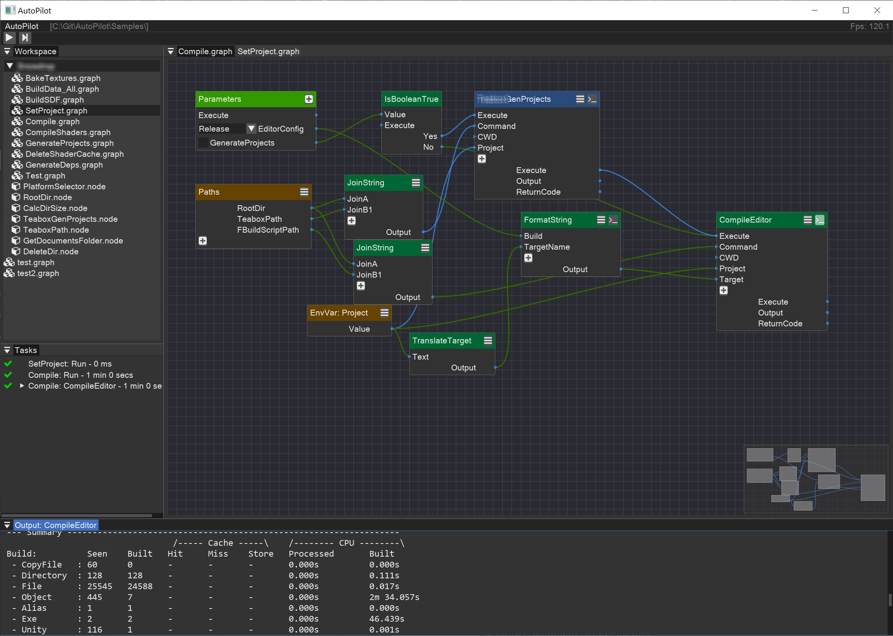

# AutoPilot
Graph based GUI tool to automate system tasks

## Idea
Developers usually work with many tools and command-line applications to build and compile programs, process their data and do daily jobs.  
Usually automating these processes and remembering all the commands are a burden.  
This tool is a GUI shell that you can run command-line programs or scripts in a node graph. You can also provide simple logic with node graphs and make automation programs. Benefits of node graphs for this purpose are easy usage by non-coders, fast and enjoyable iterations and automatic dependency resolving for multi threaded execution of nodes.  
Target users for this program are mainly development teams consisting of different roles, programmers, artists, technical artists and designers. That need to have a customized easy-to-use automation for the entire team.

Some example use cases would be:
- Compiling and Configuring your project with different configurations and paramerters
- Baking assets with different arguments for game development and other similar projects
- Fetch some information from a remote server and act based on returned results
- Deploy data to a remote server or another machine
- Just daily clean ups, like delete your intermediate files or whatever

### Features
- No external dependencies
- Support for workspace folders that contain all the graphs and their settings
- Ability to implement custom Nodes and Properties in C++
- Automatic dependency resolving in the node graph and run tasks in multiple threads
- Records graph run history and timings
- Provides it's own stdout console view for each running node
- Configurations per workspace (`workspace.ini` in workspace root directory) that can be accessed in node graphs
- Ability to embed graphs inside other graphs. Just drag&drop graphs from workspace view into other graphs
- Save individual nodes as an external file so you can drag&drop them into other graphs
- Execution stepper and in/out parameter inspection on each node, for better debugging

## Build 

Just open the project files for your IDE. Compile and Run.
Currently supported IDEs are:
- Microsoft Visual Studio 2022
- Xcode 

### Mac prerequisites

- libpng (needed by libfreetype): `brew install libpng`
- harfbuzz (needed by libfreetype): `brew install harfbuzz`
- brotli (needed by libfreetype): `brew install brotli`

## Note

This program is at a very early stage and is experimental. I'm just testing the idea to try out the use cases and get people's feedback. So expect bugs and incomplete features. But feedbacks and comments are always welcomed of course. 
If you want to send a personal feedback, I'm on discord with `septag` Id.

